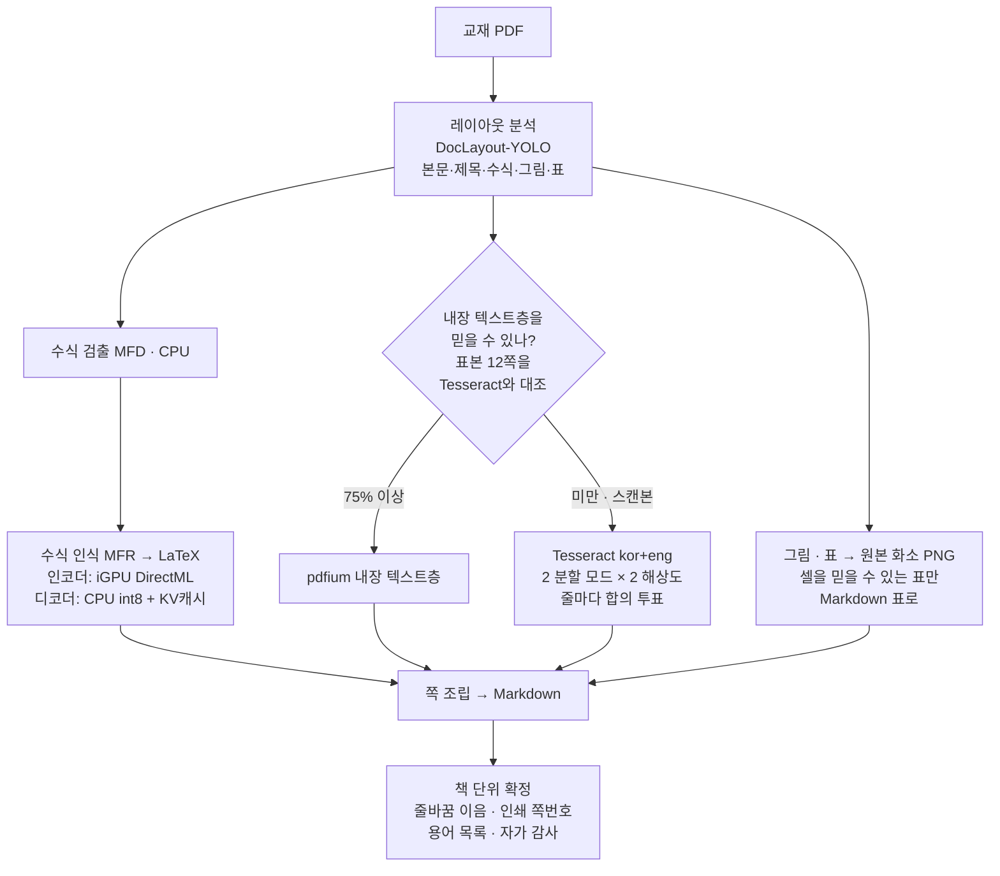

# PDF OCR — 교재 PDF를 AI가 읽을 수 있는 Markdown으로

[](https://github.com/mijnch/pdf-ocr-korean-textbook/actions/workflows/tests.yml)
[](LICENSE)


> 한국어 공대 교재 PDF를 **완전 오프라인**으로 Markdown + PNG로 바꾸는 OCR 파이프라인.
> 수식은 LaTeX로, 그림은 원본 화소 PNG로, 쪽은 원본 PDF와 1:1로 남기고,
> **확신할 수 없는 표·쪽번호는 틀린 채 내보내지 않고 버리거나 드러낸다.**

| | |
|---|---|
| **입력 → 출력** | 교재 PDF(스캔본 · 내장 텍스트층) → 쪽별 Markdown + 그림 PNG |
| **동작 방식** | 전부 로컬 (Tesseract · pix2text ONNX · pdfium). 인식 중 외부 연결·DNS 시도 0건을 소켓 수준에서 확인 |
| **온디바이스 가속** | 수식 인식 모델을 **KV캐시 + int8로 재제작**해 인식 4.16배 · 인코더는 내장 GPU(DirectML) |
| **규모** | 실제 교재 **9권 7,530쪽** 재변환, 페이지 실패 0 |
| **정확도** | 원본 쪽 대조 **문자 일치율 93.8% · 낱말 회수율 96.5%** (8권 16쪽 전사 대조) |
| **검증** | 골든 테스트 290건 (모델 없이 실행, CI) + 원본 쪽 정답지 채점 스크립트 |
| **설치** | `환경 설치.bat` 한 번 — 모델 252MB는 릴리스에서 자동으로 받는다 |

<details>
<summary><b>In English</b></summary>

A fully offline pipeline that turns Korean university engineering textbooks — scanned, or with a
publisher's embedded text layer — into **page-aligned Markdown + PNG** that an LLM assistant can
grep and read, with math recovered as LaTeX.

The problem was access, not reading quality: the assistant's PDF reader refuses files over 100 MB
(6 of the 9 books), and 7,530 pages would not fit in a context window anyway. So every
`## N페이지` section maps 1:1 to PDF page N, and the printed page number is recovered per page.

- **layout** — DocLayout-YOLO regions (body / title / formula / figure / table)
- **math** — formula detection + recognition to LaTeX. The recognizer's ONNX decoder had no KV
  cache (O(n²) generation) and its PyTorch weights are not published, so the ONNX initializers were
  transplanted into an identical `transformers` model, re-exported with past key/values and
  quantized to int8 — **4.16× faster recognition** on a 305-formula A/B. The encoder runs on the
  laptop iGPU via DirectML while the CPU decodes the previous batch.
- **text** — the embedded text layer when a 12-page self-check against Tesseract says it can be
  trusted; otherwise Tesseract kor+eng in 2 segmentation modes × 2 resolutions with per-line
  consensus voting
- **book-level pass** — line-break joins decided from the book's own vocabulary, printed page
  numbers cross-checked against neighbours (longest increasing subsequence), a glossary of the
  book's own terms, and a self-audit that states it never compared against the original

Guiding rule: **a wrong table or page number is worse than none.** Tables whose cells cannot be
trusted are kept only as PNG; page numbers that cannot be confirmed are dropped.

Measured on 9 real textbooks (7,530 pages): 0 page failures, 93.8% character accuracy and 96.5%
word recall against hand-transcribed pages (8 books, 16 pages). 290 golden tests run without models
in CI. Windows-first; Korean UI.

</details>

---

## 왜 만들었나

AI 비서에게 교재를 읽히려 했더니 두 벽에 막혔습니다.

- 읽기 도구가 **100MB 넘는 PDF를 열지 못합니다.** 보유 9권 중 6권이 여기 걸립니다(748MB, 677MB, 605MB, 590MB, 218MB, 190MB).
- 열린다 해도 **7,530쪽은 컨텍스트에 안 들어갑니다.** 스캔 1쪽이 약 1,500~2,000토큰이니 한 권이 200만 토큰대입니다.

그래서 필요한 것은 "PDF를 더 잘 읽는 법"이 아니라 **검색 가능한 무작위 접근**이었습니다.
MD도 통째로는 못 읽지만(최대 2.3M자) grep으로 쪽을 특정하고 그 절만 읽을 수 있습니다.
정밀 확인이 필요하면 잘라낸 PNG를 엽니다 — 크기 제한이 없고 원본 화소 그대로입니다.

## 산출물

*아래는 형식을 보이기 위한 가상 예시입니다.*

````markdown
# 가상 회로이론.pdf

> **AI 안내**: 이 문서는 `가상 회로이론.pdf`의 OCR 변환본이다. '## N페이지' 절은 원본 PDF의
> N쪽과 1:1로 대응한다. … 쪽 제목의 '(인쇄 N쪽)'은 교재에 인쇄된 쪽번호다 — PDF 쪽과 인쇄 쪽의
> 차이는 일정하지 않아(같은 책 안에서도 변한다) 산술로 환산하면 안 된다. …

## 이 책이 쓰는 용어

> 아래는 이 책의 찾아보기에서 뽑아 본문 등장을 확인한 표기다. 검색이 0건이면 표준 용어가 아니라
> **이 책의 표기**로 다시 찾아보라 (예: 전기장→전계, 테브난→테브냉, …).

노턴 등가회로, 전계, 테브냉 등가회로, …

## 57페이지 (인쇄 50쪽)

어떤 선형 회로든 두 단자에서 보면 전압원 하나와 저항 하나의 직렬 연결로 바꿀 수 있다.

$$ R_{th} = \frac{V_{oc}}{I_{sc}} $$  (2.12)


*그림 2.8 테브냉 등가회로*

### 예제 2.4

그림 2.8의 회로에서 단자 a-b의 테브냉 등가회로를 구하라.

> [변환 완료] 412페이지, 검출 수식 2,380개
````

| 요소 | 뜻 |
|---|---|
| `## N페이지 (인쇄 M쪽)` | 원본 PDF N쪽과 1:1. 인쇄 쪽번호는 이웃 쪽과 대조해 **확정된 것만** 붙는다 |
| `$$ … $$  (2.12)` | 수식 LaTeX. 오른쪽 여백의 수식 번호를 같은 행의 수식에 붙인다 |
| `` | 그림·표 영역의 원본 화소 PNG. 셀을 믿을 수 있는 표만 Markdown 표로 함께 싣는다 |
| `### 예제 2.4` | 예제·정의·정리 같은 절 표지를 헤딩으로 올린다 |
| `> [변환 완료]` | 이 줄이 없으면 중단으로 잘린 파일이다 — 다시 실행하면 끊긴 쪽부터 이어 쓴다 |

## 구조



산출물은 `## 400페이지 (인쇄 392쪽)` 절로 원본 쪽과 1:1 대응합니다.
쪽들은 겹쳐 흐릅니다 — 다음 쪽의 렌더링·레이아웃 분석·Tesseract가 이번 쪽의
수식 인식과 동시에 돕니다. 순서만 겹칠 뿐 쪽마다 같은 입력으로 같은 인식을 합니다
(순차 처리와 쪽별 인식 입력·출력 지문이 같음을 대조했습니다).

변환이 중간에 끊기면(전원·Ctrl+C) 같은 PDF를 다시 실행할 때 **끊긴 쪽부터 이어 씁니다.**
마지막 쪽 절은 덜 쓰였을 수 있어 그 쪽부터 다시 읽고, 책 단위 확정은 이어 쓴 뒤
파일 전체를 다시 읽어 합니다 — 끊지 않고 변환한 것과 결과가 같음을 대조했습니다.

## 온디바이스 추론 — 노트북 한 대에서, 오프라인으로

GPU 서버나 클라우드 API 없이 **노트북의 CPU와 내장 GPU만으로** 수천 쪽을 변환하도록 설계했습니다.
연산을 어디에 둘지는 장치마다 재 보고 정했습니다.

| 단계 | 장치 | 근거 |
|---|---|---|
| 수식 인식 인코더 | 내장 GPU (DirectML) | iGPU가 다음 배치를 인코딩하는 동안 CPU가 현재 배치를 디코딩한다. 배치 구성이 순차 경로와 같아 출력도 같다 (305크롭 305/305 일치) |
| 수식 인식 디코더 | CPU (int8) | int8 연산자를 DirectML이 지원하지 않는다 |
| 수식 검출 | CPU | iGPU로 옮기면 전송 오버헤드가 이득을 상쇄한다 |
| 쪽 사이 | CPU 스레드 겹침 | 다음 쪽의 렌더링·레이아웃 분석·Tesseract가 이번 쪽의 수식 인식과 동시에 돈다 (4권 × 20쪽: 쪽당 시간 −15% · −15% · −16% · −27%) |

### 수식 인식 모델을 다시 만들었다 — KV캐시 + int8

원본 수식 인식 모델(pix2text MFR 1.5)의 ONNX 디코더에는 **KV캐시가 없어** 토큰을 하나 만들 때마다
앞 토큰 전체를 다시 계산했습니다 — 생성이 O(n²)입니다. 캐시를 넣으려면 다시 수출해야 하는데
**PyTorch 가중치는 공개되어 있지 않았습니다.**

1. ONNX initializer의 이름이 모듈 경로를 그대로 보존한다는 점을 이용해 가중치를 적출하고,
2. 같은 구조의 `transformers` 모델에 이식한 뒤,
3. with-past(KV캐시 포함)로 다시 수출하고 int8로 양자화했습니다. 단계마다 수치 동등성을 검증했습니다.

실측(305수식 A/B): **인식 4.16배**, 정규화 일치 90.8% — 차이는 `\biggl`↔`\left` 같은 렌더 동등 변형입니다.
이 모델은 HuggingFace에 없으므로 [릴리스](https://github.com/mijnch/pdf-ocr-korean-textbook/releases/tag/assets-v1)로
배포하고, 재제작 스크립트를 [`scripts/mfr_rebuild/`](scripts/mfr_rebuild)에 남겼습니다.

### 가속이 조용히 꺼지지 않게

가속은 실패해도 오류가 나지 않습니다 — 그냥 느려집니다. 실제로 의존성이 DirectML판
`onnxruntime`을 일반판으로 덮어써 **가속이 꺼진 채 한참 돌았습니다**
([아래 사례](#의존성이-가속을-조용히-죽인다)). 지금은 설치 맨 끝에서 DirectML을 다시 씌우고
iGPU 공급자가 실제로 잡히는지 검증합니다. 모델을 올리고 인식하는 동안 외부 연결이 없다는 것도
소켓 수준에서 확인했습니다([배포 설계](#배포-설계)).

## 설계에서 배운 것

실측이 직관을 뒤집은 사례들입니다. 코드 주석에 근거를 함께 남겼습니다. 요약하면 다음과 같고, 각 항목의 경위와 수치는 표 아래에 있습니다.

| 교훈 | 실측에서 드러난 것 | 지금의 대응 |
|---|---|---|
| [틀린 표는 표가 없는 것보다 나쁘다](#틀린-표는-표가-없는-것보다-나쁘다) | 출판사 선행 OCR 층에서 온도계수가 **10만 배** 틀린 채 깨끗한 표로 나감 | 셀을 못 믿으면 표를 버리고 PNG만 |
| [인쇄 쪽번호는 상수 오프셋이 아니다](#인쇄-쪽번호는-상수-오프셋이-아니다) | 한 책 안에서 `+13 → +8 → +4 → −3` | 쪽마다 읽고 이웃 대조 · 최장 증가 부분열 → 회수율 92.4→95.6%, 중복 0 · 역행 0 |
| [검색 실패는 조용하다](#검색-실패는-조용하다) | 표준 용어 grep 0건인데 책이 다르게 부르는 경우 21.6% | 찾아보기에서 **그 책의 용어 목록**을 뽑아 문서 머리에 |
| [감사가 "결함 0건"이라 말하는 동안](#감사가-결함-0건이라-말하는-동안-표는-틀려-있었다) | 구문만 보는 감사 수치가 품질 근거로 읽힘 | 범위를 문구로 못 박고, 원리상 안 되는 점검은 "건너뛴다"고 적음 |
| [색 배경 상자는 통째로 사라진다](#색-배경-상자는-통째로-사라지는데-아무-경고도-나지-않는다) | 한 권 84쪽의 예제가 본문에서 소실, 감사는 조용 | 칠해진 큰 영역만 다시 읽어 한글 산문을 되살림 → 84쪽 중 74쪽 회복 |
| [중복은 위치로 막을 수 없다](#중복은-위치로-막을-수-없다) | 한 권 40.3% 쪽에 같은 문장이 다르게 깨져 끼어듦 | 세로 겹침 비율 + 내용 메아리 → 검출 쪽 267→51, 311→155 |
| [설정 파일 하나가 없어지면 책이 망가진다](#설정-파일-하나가-없어지면-책이-망가진다--그리고-아무도-모른다) | 낱말 회수율 96.4% → 10.8%, 감사는 결함 0건 | 표본 12쪽으로 내장층을 스스로 재고 75% 미만이면 스캔 경로 |
| [잘못된 꼬리표 하나가 페이지를 무너뜨린다](#한-영역의-잘못된-꼬리표가-페이지-전체를-무너뜨린다) | 2단 쪽이 단단으로 읽혀 문자 일치율 62.4% | 칼럼 중앙값에서 벗어난 영역의 꼬리표를 불신 → 95.5% |
| [줄 끝에서 잘린 낱말은 grep에 안 걸린다](#줄-끝에서-잘린-낱말은-grep에-안-걸린다) | 정답지 16쪽 중 15쪽에 `전 압을` 같은 조각 | 책 자신의 어휘로 이음 판정 + EM 사전확률 → 낱말 회수율 94.3→96.2% |
| [보호 문턱은 언어마다 다르다](#보호-문턱은-언어마다-다르다) | 한국어 본문 한 줄은 60자 문턱에 못 미쳐 첫 문단이 소실 | 글자 수 대신 레이아웃(본문 영역)으로 판정 |
| [승자독식은 줄 단위로 틀린다](#승자독식은-줄-단위로-틀린다) | `전류원은` → `ARAL`, 신뢰도로는 못 가름 | 네 판독 중 서로 가장 합의된 줄 → 바뀐 35줄: 나아짐 16 · 나빠짐 6 |
| [저해상 스캔은 키워서 읽는다](#저해상-스캔은-키워서-읽는다--키우는-방법까지-중요하다) | 195dpi: 87.1% → 300dpi 92.1% (PIL 확대는 89.9%) | PDF 엔진이 원본 이미지에서 직접 확대 |
| [의존성이 가속을 조용히 죽인다](#의존성이-가속을-조용히-죽인다) | DirectML판이 일반판에 덮여 가속이 꺼진 혼성 상태 | 설치 끝에 DirectML 재설치 · 검증 |
| ['없다'에는 유효기간이 있다](#없는-문제는-고치지-않는다--다만-없다에는-유효기간이-있다) | 보유 5권에 없던 기울어짐 문제가 새 교재에서 발생 | 결론은 표본에서 나오고, 표본이 바뀌면 다시 잰다 |

### 틀린 표는 표가 없는 것보다 나쁘다

셀 인식이 못 미더우면 표를 통째로 버리고 PNG만 남깁니다.
내장 텍스트층 책에도 같은 게이트를 겁니다 — 어떤 책의 내장층은 출판사 선행 OCR이라
`10`이 `IO`로 깨져 지수 이식이 조용히 실패하고, 비저항표의 온도계수가 `10⁻³`에서 `10⁻⁸`로
**10만 배** 틀린 채 깨끗한 Markdown 표로 나갔습니다. 가장 위험한 형태는 **한 표 안에서
절반만 복원된 것**입니다 — 나머지가 맞으니 표 전체를 신뢰하게 됩니다.

### 인쇄 쪽번호는 상수 오프셋이 아니다

"PDF 쪽 − N = 인쇄 쪽"으로 환산하려 했으나
실측하니 같은 책 안에서도 `+13 → +8 → +4 → −3`으로 부호까지 바뀝니다.
단일 오프셋을 안내하면 AI가 자신 있게 틀린 쪽을 읽습니다. 그래서 쪽번호를
**쪽마다 새깁니다** — 그것도 도구가 머리말로 버리던 상단 띠에서 건져 냅니다.
쪽마다 독립으로 읽으면 장 번호가 쪽번호로 둔갑하므로, 이웃 쪽과 오프셋을 대조해
튄 값을 지웁니다. **확인 못 한 쪽번호는 없는 것보다 나쁘기 때문입니다.**

### 그 허용 오차는 너무 헐거웠다

이웃 중앙값에서 ±3까지 봐주고 있었는데,
새 표본에서 오독이 정확히 그 폭 안으로 떨어졌습니다 — 본문 오프셋이 25로
일정한 책에서 22와 27이 섞여 통과했고, PDF 200쪽(실제 175쪽)에 `인쇄 178쪽`이
새겨져 **203쪽과 같은 번호를 달았습니다.** 지금은 세 겹으로 확정합니다:
① 허용 오차 1 — 정상인 책 세 권은 한 개도 잃지 않았습니다(485→485, 921→921,
960→960). ② 인쇄 번호는 뒤로 갈수록 반드시 커지므로 **최장 증가 부분열**만
남깁니다 — 역행이 0이 됩니다. ③ 앞뒤 두 확정값의 오프셋이 같으면 그 사이는
**증명된 것**이므로 채웁니다(산술 환산이 아니라 두 앵커가 함께 보이는 증거입니다).
장 표지처럼 번호가 안 찍힌 쪽도 번호는 매겨져 있으니까요 — 실제로 PDF 71쪽이
50, 73쪽이 52일 때 72쪽은 51입니다(머리말이 빈 장 표지였습니다).
회수율은 그대로 오르고(92.4%→95.6%) 오탐은 사라집니다.

### 검색 실패는 조용하다

표준 용어로 grep하면 0건인데 그 책은 다르게 부르는 경우가
실측 21.6%였습니다(전기장→전계 201쪽, 테브난→테브냉 69쪽). "교재에 없다"와
"교재가 다르게 부른다"는 화면상 구별되지 않습니다. 그래서 찾아보기에서 **그 책이 쓰는
용어 목록**을 뽑아 문서 머리에 싣습니다.

### 감사가 "결함 0건"이라 말하는 동안 표는 틀려 있었다

자가 감사는 구문만 검사하고
원본과 한 번도 대조하지 않는데, 그 숫자가 품질 근거로 읽혔습니다. 지금은 범위를
문구로 못 박습니다 — *"기계 점검만. 원본 PDF와 대조하지 않으므로 내용 정확성은
보증하지 않는다."* 점검 하나하나에도 같은 규칙을 적용합니다: 중복 삽입 점검은
한글 창을 세는 방식이라 영문 문서에서는 원리상 작동하지 않습니다(라틴 글자로
넓혀 봤더니 목차의 정당한 반복이 대량으로 걸렸습니다 — 창을 14자에서 30자로
늘려도 35건이 남았고, 들여다본 것은 모두 오탐이었습니다. `Representation of
Discrete-Tim`은 목차에 두 번 나오는 진짜 장 제목이니까요). 그래서 영문 문서에는
0건이라 적지 않고 **"이 점검은 건너뛴다"**고 적습니다.

### 색 배경 상자는 통째로 사라지는데, 아무 경고도 나지 않는다

어떤 교재는 예제를
옅게 칠한 상자에 담습니다. 레이아웃 모델은 그 상자를 **그림 한 장**으로 잡고,
그러면 OCR 마스크가 상자 안을 아예 읽지 않습니다. 문제문도 풀이도 결과식도
본문에서 사라집니다 — 한 권에서 **84쪽**, 그 쪽들의 본문은 책 평균의 58%였습니다.
감사는 조용합니다. 문법도 링크도 멀쩡하니까요. **산출물만 봐서는 알 수 없고,
원본 쪽을 열어야 보입니다.** 지금은 큰 영역 중 바탕이 칠해진 것만 골라 한 번 더
읽고, 문장이 나오면 본문으로 되살립니다 — **84쪽 중 74쪽이 돌아왔습니다.**
도표 라벨(`Q3` `Vout`)은 짧아서 걸러집니다. 절반 이상이 표(TABLE)로 분류돼 있어
표도 후보에 넣되 판정을 달리했습니다: **한글 산문만 인정합니다.** 영문 낱말까지
허용하면 진짜 표가 통과하기 때문입니다(실측: 발진기 비교표 한 장이 영단어 60개에
한글 0자 / 같은 책 예제 상자는 한글 122~539자). 여기서 되살리는 것은 흐르는 글이지
격자를 가진 표가 아니고, 표 자체는 지금도 PNG로 남습니다.
비용도 함께 막았습니다 — 큰 영역의 크롭 OCR은 페이지 한 장을 다시 읽는 것과
비슷한 비용이라, 큰 그림을 모두 다시 읽으면 변환 시간이 배로 뜁니다. 바탕색 조건과
쪽당 상한(2개)으로 후보를 좁혔습니다.

### 중복은 위치로 막을 수 없다

두 해상도·두 PSM의 판독을 합칠 때, 승자에게 없는
줄만 보충하도록 '겹치면 건너뛰기'를 걸어 두었습니다. 그런데 두 판독이 줄을 다르게
자르면 보충 줄의 중심이 주 줄 **사이 틈**에 떨어져 그대로 통과합니다. 같은 문장이
서로 다르게 깨진 채 문단 한가운데 끼어들었고(한 권은 40.3%의 쪽), 감사는 이것을
'확인 필요'로만 셌습니다. 지금은 두 겹으로 막습니다 — 세로 겹침 **비율**로 보고,
그래도 통과하면 **내용의 메아리**(이미 읽은 글자 토막의 재탕 비율)로 거릅니다.
검출 쪽 수가 267→51, 311→155로 줄었습니다. 남은 것은 한 판독 **안에서** 같은 줄이
두 번 나온 경우라 합치는 단계에서는 볼 수 없습니다 — 다음 차례입니다.

### 설정 파일 하나가 없어지면 책이 망가진다 — 그리고 아무도 모른다

어떤 책의
내장 텍스트층은 출판사 선행 OCR이라 한글을 한 글자씩 띄웁니다(`각 상 당 평 균 전 력`).
그래서 그 책만 `장구분.toml`에 `force_scan`을 적어 스캔 경로로 돌려 왔습니다.
그런데 그 파일이 사라졌습니다. 다시 변환해 보니 **낱말 회수율이 96.4%에서 10.8%로**
떨어졌고, 자가 감사는 결함을 **한 건도** 보고하지 않았습니다 — 원본과 대조하지
않으니까요. 사람이 적어 둔 지식에 품질이 걸려 있었고, 그 지식은 파일 하나였습니다.

지금은 도구가 스스로 잽니다. 표본 12쪽에서 내장층과 Tesseract를 맞대어 겹치는
낱말 비율을 보고, 75% 미만이면 스캔 경로로 돌립니다. 4권 실측이 문턱을 정했습니다 —
망가진 책 67.9%, 정상 책 81.0 / 91.9 / 97.1%로 **13포인트가 벌어져** 있습니다.
설정이 있으면 설정이 우선입니다. 이건 대체물이 아니라 **그물**입니다.

### 한 영역의 잘못된 꼬리표가 페이지 전체를 무너뜨린다

레이아웃 모델이 오른쪽 단의
문단 하나에 왼쪽 칼럼 번호를 붙이면, 그 한 영역이 칼럼 폭을 페이지의 78%로 늘려
거터를 지웁니다. 그러면 2단 페이지가 단일 취급되어 Tesseract가 좌·우를 가로질러
읽습니다 — 문제 5.49의 문장 한가운데 5.53의 문장이 끼어들었고, 그 쪽의 문자
일치율은 62.4%였습니다(같은 책 단단 쪽은 94.1%). 제 칼럼 중앙값에서 크게 벗어난
영역은 꼬리표를 믿지 않게 하니 **95.5%**가 됐습니다. 읽기 순서 쪽에는 좌표만 보는
판정을 하나 더 뒀습니다 — 오른쪽 끝의 수식 번호 라벨 두 개가 거터를 폭의 89%
지점에 만들어 여백 상자를 본문 문단 한가운데로 밀어 넣던 것을 막습니다.

### 줄 끝에서 잘린 낱말은 grep에 안 걸린다

한국어 조판은 낱말 한가운데서도 줄을
바꿉니다(`전|압을`, `생각해보|자`). 줄을 공백으로 이으면 `전 압을`이 되어 `전압`을
찾아도 그 자리가 나오지 않습니다 — 정답지 16쪽 중 15쪽에 있었고, 텍스트층이 정확한
책도 같았습니다(`방 향이`, `움 직임`). 그렇다고 무조건 붙이면 진짜 띄어쓰기(`나타낼 수|있으며`)가
사라집니다. 줄 하나만 봐서는 가를 수 없으므로, 이음매에 표식만 남기고 책이 다 모인 뒤
**그 책이 줄 가운데서 쓴 표기**를 증거로 정합니다 — 외부 사전이 아니라 책 자신의 어휘입니다.
낱말(`전압을` 대 `전 압을`의 횟수)로 먼저 보고, 모르면 한국어 자동 띄어쓰기의 표준 방식인
음절 문맥으로 물러섭니다. 책 절반으로 배우고 나머지 절반의 실제 띄어쓰기로 시험했습니다:
글자 단위로 줄을 바꾸는 조판 94.7~96.4%, 낱말 단위 조판 99.3~99.6%. 두 조판을 가르는
사전확률은 처음에 확정된 판정만으로 셌더니 치우쳤습니다 — 흔한 낱말 안쪽일수록 확정되기
쉬워 0.70이 0.86으로 부풀었고, 모든 이음매로 혼합 비율을 추정(EM)하니 맞았습니다.
정답지 낱말 회수율 **94.3% → 96.2%**.

### 보호 문턱은 언어마다 다르다

쪽 상단 7.2% 띠의 줄은 러닝 헤더로 버리되, 60자가
넘으면 본문으로 살려 왔습니다. 영문 본문 한 줄은 이 문턱을 넉넉히 넘지만 **한국어 본문
한 줄은 40~50자**라 걸리지 않습니다. 상단 여백이 좁은 자료에서는 첫 문단 윗줄들이 띠 안에
들어와 통째로 사라졌습니다(쪽 위 6%를 잘라 재현하면 첫 문단 3줄 소실). 지금은 글자 수
대신 레이아웃을 봅니다 — 띠 아래로 이어지는 본문 영역 안의 줄은 본문입니다. 러닝 헤더는
레이아웃이 '버림'으로 따로 잡습니다(스캔본 표본 150쪽 전부). 9권 표본에서 본문 영역이
띠 안에서 시작하는 43쪽을 대조해 머리말이 새어 들어온 곳이 없음을 확인했습니다.

### 승자독식은 줄 단위로 틀린다

Tesseract를 두 가지 분할 모드로 돌려 글자를 더 많이
읽은 쪽을 채택해 왔습니다. 그런데 이긴 쪽이 줄 단위로는 틀리는 일이 흔했습니다 —
`회로에`를 `희로에`로, `전류원은`을 `ARAL`로, `대체할`을 `HAT`로 읽었고, 진 쪽과
기준 해상도의 두 판독은 모두 바르게 읽었습니다. 줄 신뢰도는 93 대 94로 가르지
못합니다. 그래서 네 판독(두 모드 × 두 해상도) 중 **서로 가장 합의된 줄**을 고릅니다 —
우연한 오독은 다른 판독과 어긋나고, 바른 판독은 서로 겹칩니다. 바뀐 줄 35개를
정답지와 하나씩 대조해 나아짐 16 · 나빠짐 6 · 같음 13을 확인하고 들였습니다.

### 저해상 스캔은 키워서 읽는다 — 키우는 방법까지 중요하다

195dpi 스캔을 300dpi로
키워 읽자 문자 일치율이 87.1%에서 92.1%로 올랐습니다. 처음엔 기준 렌더링을 PIL로
키웠는데 89.9%에 그쳤습니다 — 두 번 보간한 것입니다. PDF 엔진이 원본 이미지에서 바로
키우게 하니 이득이 온전히 나왔습니다. 키운 이미지는 글자 인식에만 씁니다. 수식 크롭과
그림 저장은 원본 화소가 기준입니다(키워도 정보는 늘지 않고 PNG만 커집니다).

### 의존성이 가속을 조용히 죽인다

pix2text가 `cnocr[ort-cpu]`·`optimum[onnxruntime]`을
하드 의존으로 요구해, 무엇을 고정하든 일반 `onnxruntime`이 따라 들어와 같은 폴더를
덮어씁니다. 실제로 한 번 당했습니다 — 패키지 메타데이터는 고정 버전 그대로인데
DLL만 바뀌어, **`import` 버전과 `dist-info` 버전이 어긋난 혼성 상태**가 됐고 그대로
동작해서 한참 몰랐습니다. 지금은 설치 맨 끝에서 DirectML을 다시 씌우고 검증합니다.

### 없는 문제는 고치지 않는다 — 다만 '없다'에는 유효기간이 있다

기울어진 스캔의
문장 순서 섞임은 실재하는 실패 모드지만, 보유 5권을 재보니 줄 상자 높이가 정상이라
해당 없음이었습니다. 그래서 검증 안 된 전처리를 넣지 않았습니다 — 판단 자체는
지금도 옳다고 봅니다. **그런데 새로 넣은 교재에서는 실제로 일어났습니다**(문단
마지막 줄이 문단 한가운데로 들어갔습니다). 표본에 없다는 것은 세상에 없다는 뜻이
아니었습니다. 그래서 이 항목은 지우지 않고 남겨 둡니다 — 근거는 표본에서 나오고,
표본이 바뀌면 결론도 바뀐다는 것을 이 줄이 증명합니다.

## 실측

| 항목 | 값 |
|---|---|
| 처리량 | 9권 7,530쪽 재변환 — 스캔본 쪽당 약 5.5초, 내장 텍스트층 약 3.5초 (단독 실행 실측) |
| 쪽 겹침 효과 | 4권 × 20쪽 구간: 쪽당 시간 −15% · −15% · −16% · −27% |
| 페이지 실패 | 0 |
| 그림 추출 | 9,673개 (깨진 링크 0, 고아 파일 0) |
| 본문 유사도 (세대 간) | Dice 99.31~99.98% |
| **원본 쪽 대조** | **문자 일치율 93.8% · 낱말 회수율 96.5%** — 8권 16쪽 전사 대조, 재변환한 말뭉치 (이전 93.4% · 94.3%) |
| 기계 교차 대조 | 산문 회수 95.6% · 정밀도 98.5% — 내장층 있는 책 504쪽 |
| 인쇄 쪽번호 회수 | 90.5~97.2% · 중복 0 · 역행 0 (쪽번호가 인쇄되지 않은 판본 1권은 0이 정답) |
| 골든 테스트 | 290건 (모델·외부 프로세스 없이 실행). CI는 매 push마다 Windows·Python 3.14에서 돌리며, 개인 장 구분 파일이 필요한 2건은 건너뛴다 |
| 저장소 크기 | 소스 380KB — 모델 252MB는 릴리스 자산 |

가속: 수식 인식 모델을 KV캐시 + int8로 재제작하고(인식 4.16배), 인코더를 DirectML(iGPU)에
올렸습니다 — 인코더 약 1.53배, 파이프라인 약 1.27배. 설계는 [온디바이스 추론](#온디바이스-추론--노트북-한-대에서-오프라인으로) 참조.

## 배포 설계

도구가 **자기 폴더 밖에 아무것도 남기지 않습니다.** 모델은 `scripts/models/`,
작업용 임시 폴더는 `.tmp/`, 산출물은 `PDF OCR/` 아래입니다.
모델 위치는 pix2text가 공식 지원하는 `PIX2TEXT_HOME`으로 지정합니다.

의존성의 기본값이 이 약속을 깨고 있었습니다. 레이아웃·수식 검출이 쓰는 ultralytics
계열은 온라인이면 **예측마다 사용 통계를 모아 60초마다 Google Analytics로 보내고**
(설정 파일의 고정 식별자 포함), 설정 파일을 사용자 `%APPDATA%`에 만듭니다. 지금은
둘 다 막고 설정은 `.tmp/` 안에 둡니다 — 모델을 올리고 인식하는 동안 외부 연결·DNS
시도가 0건임을 소켓 수준에서 확인했습니다.

**새 클론으로 다시 확인했습니다.** GitHub에서 새로 받아 릴리스 자산만 붙이고, 네트워크를
아예 없앤 격리 환경(Linux)에서 변환해 보니 두 가지가 드러났습니다. 의존성(matplotlib)이
글꼴 캐시를 **사용자 홈에** 만들었고, 동시에 띄운 Tesseract들이 OpenMP 스레드를 다투며
**쪽마다 180초 제한을 넘겨 변환이 실패**했습니다(Tesseract 단독으로는 쪽당 1초 미만).
지금은 캐시를 `.tmp/` 안에 두고 Tesseract에만 `OMP_THREAD_LIMIT=1`을 겁니다 — 같은 조건에서
변환이 끝까지 되고, 홈·임시 폴더·실행 위치에 남는 것이 없음을 확인했습니다.
Windows에서 이 스레드 제한이 속도에 주는 영향은 아직 재지 않았습니다.

큰 자산을 저장소에 넣지 않은 이유는 단순합니다 — **소스는 380KB인데 모델은 252MB**입니다.
Git LFS 대신 릴리스 자산을 고른 것은 clone에 LFS 설정을 요구하지 않고,
받는 시점을 설치 스크립트가 통제할 수 있어서입니다.

`venv/`가 없으면 `PDF OCR 실행.bat`은 시스템 Python으로 물러섭니다 — 기존 사용 방식도 그대로 됩니다.
폴더째 다른 PC로 옮겨 와 `venv/`가 그 PC에서 기동하지 않으면(venv는 만든 PC의 Python 경로를 가리킵니다),
실행은 원인과 할 일을 알리고 멈추며 `환경 설치.bat`은 그것을 지우고 새로 만듭니다.

## 설치와 실행

```
환경 설치.bat        # 폴더 안에 venv 생성 → 패키지 → 모델(252MB) → 검증
PDF OCR 실행.bat     # 입력 폴더의 PDF를 변환
```

`환경 설치.bat`은 폴더 안에 `venv/`를 만들고, `requirements.txt`로 패키지를 깔고,
**저장소에 담기엔 큰 모델·언어데이터를 릴리스에서 받아** 풀고, iGPU 가속까지 확인합니다.

대상 PC에 미리 있어야 하는 것 — 별도 프로그램이라 폴더에 담을 수 없습니다:

| | 왜 필요한가 | 없으면 |
|---|---|---|
| **Python 3.14** | `venv`를 만들 바탕 — PATH에 없어도 `py` 런처로 찾습니다 | 설치 스크립트가 멈추고 알려줍니다 |
| **Tesseract 5.4** | 본문 OCR — 기본 경로(`C:\Program Files\Tesseract-OCR`)를 먼저, 없으면 PATH에서 찾습니다. 한국어 언어 데이터는 도구 폴더의 것을 쓰므로 따로 깔 필요가 없습니다 | 변환이 시작되지 않습니다 |

회귀 점검은 모델 없이 돕니다. 품질은 원본 쪽을 옮겨 적은 정답지로 잽니다:

```
venv\Scripts\python scripts\tests\test_pure.py     # 골든 테스트
venv\Scripts\python scripts\정답지_채점.py --rerun  # 정답지 쪽을 현재 코드로 다시 인식해 채점
```

정답지는 교재 내용이라 저장소에 넣지 않습니다(`정답지/`는 로컬 전용).

## 구성

| 파일 | 역할 |
|---|---|
| `scripts/pdf_ocr.py` | 오케스트레이션 — 쪽 준비·인식·조립을 겹쳐 흘리고, 책 단위로 확정·이어 쓰기 |
| `scripts/pdf_layout.py` | 레이아웃 분석 (DocLayout-YOLO) — 모델을 폴더 안에서만 찾고 외부 연결을 막는다 |
| `scripts/pdf_math.py` | 수식 검출·인식 — MFR 인코더는 iGPU(DirectML), int8 디코더는 CPU에서 교차 실행 |
| `scripts/pdf_embedded.py` | 내장 텍스트층 — 줄 복원·위첨자 이식 |
| `scripts/pdf_flow.py` | 영역 분류(색 상자·캡션·수식 번호)·읽기 순서·줄 배정 |
| `scripts/pdf_markdown.py` | 페이지 → Markdown 조립 (그림 저장·절 표지 헤딩·떨어진 캡션) |
| `scripts/pdf_pageno.py` | 인쇄 쪽번호 읽기·이웃 대조 확정 |
| `scripts/pdf_text.py` | Tesseract 계층 (2-PSM 병렬, 단어 좌표 보존) |
| `scripts/pdf_latex.py` | 수식 LaTeX 정리·호환 변환 |
| `scripts/pdf_table.py` | 격자 검출과 셀 추출 |
| `scripts/pdf_audit.py` | 자가 감사 (구문 점검 + 내용 신호) |
| `scripts/pdf_glossary.py` | 찾아보기에서 그 책의 용어 목록 생성 |
| `scripts/pdf_splice.py` | 특정 쪽만 재인식해 교체 (전권 재산출 없이) |
| `scripts/pdf_chapters.py` | 장 구분 프로파일 적용 · 변환 후 앵커 대조 |
| `scripts/정답지_채점.py` | 원본 쪽 정답지 대조 (문자 일치율 · 낱말 회수율) |
| `scripts/setup_env.py` | 폴더 안 venv 구성 · 자산 내려받기 · 가속 검증 |
| `scripts/common.py` | 외부 도구 경로 · 오프라인 가드 |
| `scripts/mfr_rebuild/` | 수식 인식 모델 재제작 — ONNX 가중치 이식 → KV캐시 포함 재수출 → int8 양자화 |
| `scripts/tests/test_pure.py` | 순수 함수 골든 테스트 290건 |
| `설정.toml` / `장구분.example.toml` | 임계값·장 구분 프로파일 (코드 수정 없이 조정) |

## 범위와 한계

한국어+영어 전공서 전용입니다. 산출물은 원본과 100% 같지 않습니다 — 스캔본의 문장 속
수식 어순, 2단 예제의 좌·우 흐름은 원본과 다를 수 있고, 이런 항목은 자가 감사가
**숨기지 않고 목록으로 드러냅니다.**

스캔 품질이 낮은 책에서는 **한글 문장에 섞인 라틴 약어가 계통적으로 깨집니다** —
`pn접합`이 `20접합`·`00접합`으로, `MOSFET`이 `058870`으로 나오는 식입니다. 한글 산문은
멀쩡한데 정작 검색어가 되는 전문 용어만 깨지므로, grep 0건이 '교재에 없다'로 읽힙니다.
Tesseract 자체의 인식 한계라 이 파이프라인의 후처리로는 복구되지 않습니다 —
용어 사전을 붙이는 별도 접근이 필요합니다. 지금으로서는 **핵심 용어 검색이 비면
그 단원의 PNG를 여는 것**이 확실합니다.

출판사가 입힌 **내장 텍스트층이 기울임꼴 변수를 한자로 깨뜨린 책**이 있습니다
(`t`→`才`, `D`→`刀`, `v₂`→`寸2` — 대학물리 1,177쪽 중 423쪽, 대학수학 628쪽 중 135쪽).
그 줄만 원본 화소로 다시 읽어 보았으나 넣지 않았습니다: Tesseract도 기울임꼴 변수를
읽지 못해 쓰레기가 다른 쓰레기로 바뀔 뿐이었고(표본 20쪽 8줄), 텍스트층 좌표가 이미지와
어긋난 책에서는 **멀쩡한 줄이 깨졌습니다**. 본문 한글은 텍스트층이 정확하므로
(정답지 98~99%) 변수 한 글자의 오류는 그대로 두는 편이 낫습니다.

장 구분은 `장구분.example.toml`을 `장구분.toml`로 복사해 쓰는 책에 맞게 채웁니다
(실제 사용 프로파일은 저장소에 포함하지 않습니다). 변환이 끝나면 각 장 제목이 앵커 쪽
근처 본문에 실제로 있는지 대조해 어긋난 앵커를 알려 줍니다.

## 라이선스

MIT — `LICENSE` 참조. 변환 대상 교재의 저작권은 각 권리자에게 있으며,
이 저장소에는 어떤 교재 내용도 포함돼 있지 않습니다.
